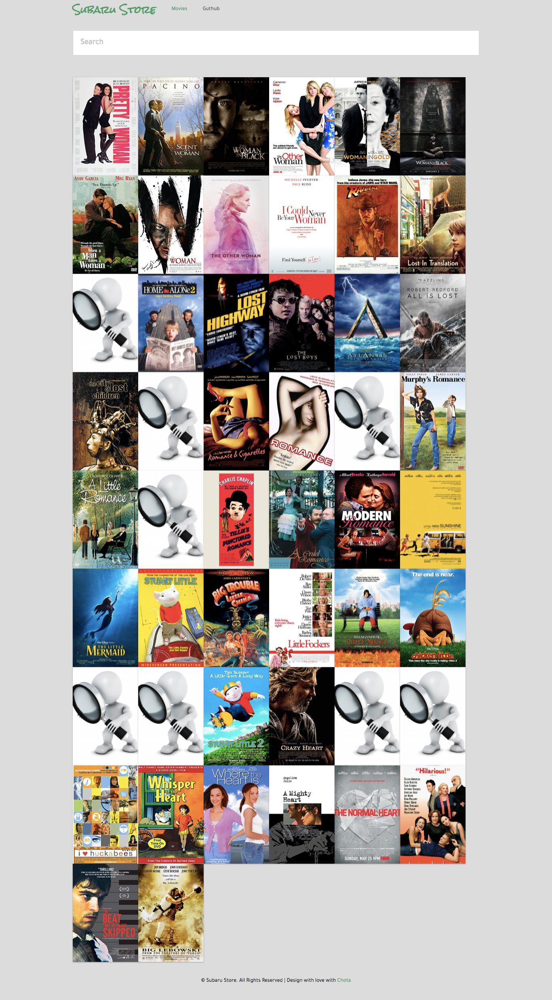

## Features
### Node
For the backend
### Typescript
For bringing types into javascript
### MongoDB
As database (you probably guessed it!)
### Graphql
For querying datas from the client
### Docker & docker-compose
For containerizing and deploying/managing the application (different services).
When the app starts, multiple containers are started:

    - the app container running the node app
    - the mongoDB container 
    - the mongo-seed container to seed the database. Exits after the seed completes
    - the Nginx container for routing/load balancing
    - the frontend container for building assets (js, css, html) for the [future] client application.

## Running the application
Prerequisites: **[Docker](https://www.docker.com/) and make** (make is preinstalled on unix computers, can be installed on windows) have to be installed on the host machine.

First clone this repo
 `git clone https://github.com/melkishengue/node-typescipt-ME-N.git`

Then 
 `cd node-typescipt-ME-N`

Run tests:
  `make test`

Run the app:
 `make start` for development or `make start-production` for production. That's it 😎

 When the installation completes, run the app at: [http://subaru-movies.localhost:9000](http://subaru-movies.localhost:9000) at localhost.

You can also visit the graphiql endoint at [http://subaru-movies.localhost:8001/api/graphql](subaru-movies.localhost:8001/api/graphql).
2 schemas have been defined: movies and reviews. You can query against them using [graphql queries](https://graphql.org/learn/queries/) :

E.g.:

`query {
  movies {
    title
    year
    imdb
  }
}`

or creating a new movie `mutation {
  createMovie(title: "The last Kindom", year: "2018", imdb: "tt005946d2") {
    title
    year
    imdb
  }
}`

The page looks like this:

To stop the app:
 Press ctrl-c and then remove all created containers by running `make clean`.

## TODO:

- add auth for mongoDB
- add swagger for API documentation (first solve the problem of redefinintion of models accross different parts of the application: graphql, mongoose, typescript and swagger...)
- convert the compose file to version 3
- deploy the app with kubernetes/rancher
- writing tests