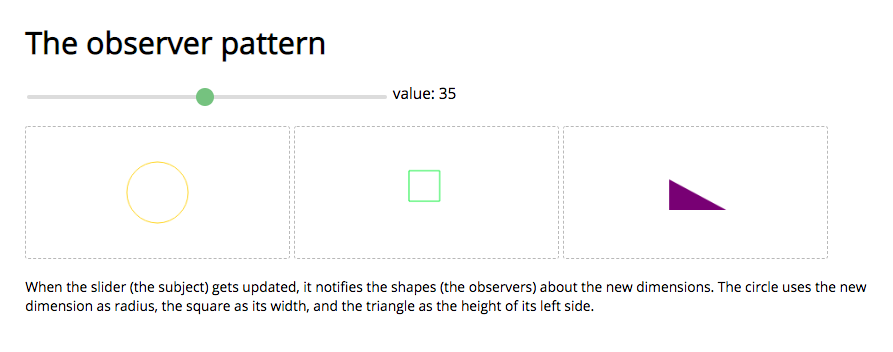

## Observer pattern in javascript

This repo presents an implementation of the observer pattern in javascript. We have a subject (the slider) that manages data and observers (the triangle, circle and square) that subscribes to changes on this data.

## Run the project

- clone this repo
- install project dependencies and build project

```
npm run install
npm run build
```

- open dist/index.html
```
open dist/index.html
```


